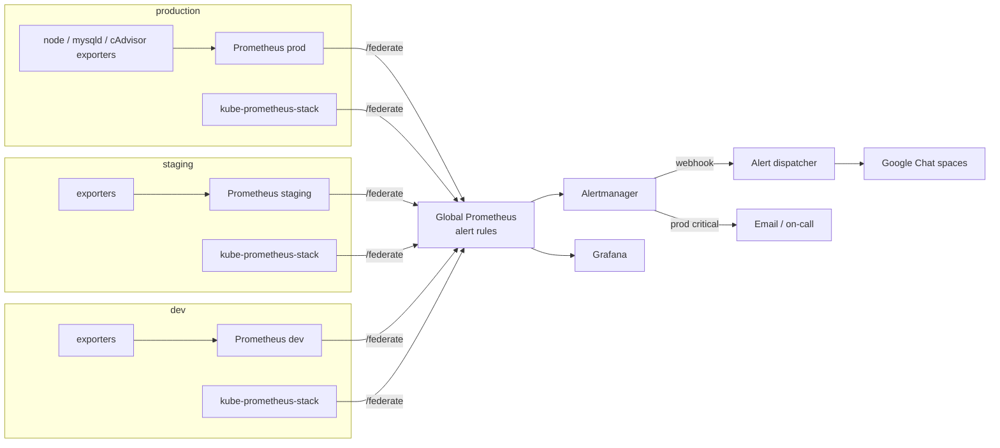

# Prometheus Federation Monitoring

Centralized monitoring for three environments (dev, staging, production) built on Prometheus federation, Alertmanager and Grafana. Each environment has its own Prometheus; a global Prometheus federates from all of them and is the single place where alerts are evaluated, routed and silenced, and where dashboards look across every environment at once.

Covers Linux servers, MariaDB (including replication to a DR site), Kubernetes clusters and standalone Docker hosts. Alerts go to Google Chat through a small dispatcher service, and production criticals also go to email.

> Based on the monitoring platform I built at work, cleaned up for publishing. Hostnames, IPs, email addresses and webhook URLs are placeholders.
>
> Two parts were team efforts: the Kubernetes side (kube-prometheus-stack in the clusters) was done together with the DevOps team, and the Google Chat dispatcher was an existing container someone else maintained. The dispatcher in this repo is my own rewrite of that piece so the project is complete and runnable on its own.

## Architecture



### Why federation and not one big Prometheus

- **Isolation.** A noisy environment (dev load tests, a broken exporter producing thousands of series) can only hurt its own Prometheus.
- **Network.** Each environment Prometheus sits next to its targets. Only one connection per environment crosses into the monitoring network, instead of every exporter port.
- **Retention.** Environment servers keep full-resolution raw data for 15 days. The global server keeps only aggregated series, so it can keep 90 days without needing much disk.
- **One place for alerts.** Rules, routing and silences live in one config. Nobody has to remember which Prometheus an alert came from.

### What gets federated

Only recording rules (any series with a `:` in the name) and `up`:

```yaml
params:
  "match[]":
    - '{__name__=~".+:.+"}'
    - '{__name__="up"}'
```

Everything an alert needs is pre-computed on the environment servers in [`prometheus/rules/recording.yml`](prometheus/rules/recording.yml): CPU, memory, filesystem ratios and a 4-hour fill prediction, MariaDB replication state and lag, container memory against its limit, and so on. That keeps the federation scrape to a few hundred series per environment. Raw metrics are still available in Grafana through the per-environment datasources when you need to drill down.

The trade-off: a new alert on a metric that isn't federated yet needs a recording rule first. That's deliberate. It forces you to decide what the alert really needs.

Each environment Prometheus sets `external_labels: {env: ...}`, and the federation jobs use `honor_labels: true`, so every series at the global level carries its `env` and original `instance` / `job`.

## What's monitored

| Area | Exporter | Alerts |
|------|----------|--------|
| Linux servers | node_exporter | down, CPU, load per core, memory, disk low / critical / filling within 4h, NIC errors, failed systemd units |
| MariaDB | mysqld_exporter | down, replication IO/SQL thread stopped, lag (warning 60s, critical 10m), connections near max, slow queries |
| Kubernetes | kube-prometheus-stack | node NotReady, pods crash looping / not ready, deployments with unavailable replicas, PVCs filling up, failed jobs |
| Docker hosts | cAdvisor | container gone, memory near limit, high CPU |
| The monitoring itself | - | federation target down or slow, environment returning no data, rule evaluation failures, notifications failing, dispatcher errors, Watchdog heartbeat |

## Alert routing

| Alerts | Goes to |
|--------|---------|
| production + critical | Google Chat `prod-alerts` **and** email to on-call, repeat every 1h |
| production + warning | Google Chat `prod-alerts` |
| staging / dev | Google Chat `nonprod-alerts`, grouped for 2 min, repeat every 12h |
| `Watchdog` | dispatcher heartbeat endpoint |

Inhibition rules cut the noise during real incidents:

- `HostDown` suppresses every other alert from the same host.
- `FederationTargetDown` / `EnvironmentNoData` suppress everything else from that environment (the data is stale anyway).
- A critical suppresses the warning of the same alert on the same instance.
- Disk critical suppresses disk low; replication stopped suppresses replication lag.

### The dispatcher

Alertmanager has no Google Chat integration, so a small service sits in between. It runs as a container on the Alertmanager host, published on `127.0.0.1:9095` only. The code is [`dispatcher/alert_dispatcher.py`](dispatcher/alert_dispatcher.py), a single Python file with no dependencies outside the standard library, packaged by [`dispatcher/Dockerfile`](dispatcher/Dockerfile) as a non-root, read-only container with a health check.

- Formats each alert group into a short readable message: severity, environment, every affected instance with its summary, runbook link, link to silence it.
- Posts with a `threadKey` derived from Alertmanager's `groupKey`, so the FIRING message and its RESOLVED follow-up appear in the same thread.
- Retries 429 and 5xx with backoff. If it still fails it returns 500 to Alertmanager, which retries the notification later instead of dropping it.
- Watches the always-firing `Watchdog` alert. If it stops arriving for 5 minutes, Prometheus or Alertmanager is broken, and the dispatcher posts that to the chat space directly. This covers the one failure that can't alert about itself.
- Exposes `/metrics`, which the global Prometheus scrapes, so dispatcher failures raise their own alert (and email still works for production).

## Repository layout

```
prometheus/
  environments/<env>/prometheus.yml   environment servers (scrape + recording rules)
  environments/<env>/targets/*.yml    file_sd target lists, reloaded every minute
  global/prometheus.yml               federation jobs + alerting
  rules/recording.yml                 recording rules (run on environment servers)
  rules/alerts/*.yml                  alert rules (run on the global server)
alertmanager/                         routing, inhibition, email template
dispatcher/                           Google Chat dispatcher, Dockerfile, tests
grafana/                              provisioned datasources + overview dashboard
kubernetes/                           kube-prometheus-stack values, PrometheusRule
ansible/                              roles to deploy all of the above on VMs
tests/                                promtool rule tests, Alertmanager routing tests
scripts/validate.sh                   runs every check CI runs
docs/runbook.md                       what to do when each alert fires
```

## Deployment

Prometheus, Alertmanager, Grafana and the exporters run directly on VMs as systemd services. The dispatcher runs as a container next to Alertmanager. All of it is deployed with Ansible:

```bash
cd ansible
ansible-galaxy collection install -r requirements.yml
ansible-vault create inventory/group_vars/alerting/vault.yml
#   vault_gchat_prod_webhook: https://chat.googleapis.com/v1/spaces/...
#   vault_gchat_nonprod_webhook: ...
#   alertmanager_smtp_password: ...

ansible-playbook site.yml --ask-vault-pass

# after editing alert rules only
ansible-playbook site.yml --tags rules
```

The dispatcher image is built on the Alertmanager host and tagged with a hash of the script, so a code change produces a new tag and the container is replaced; a config change recreates it with the same image.

The roles validate every file before it's put in place (`promtool check config`, `promtool check rules`, `amtool check-config`), so a typo never reaches a running server. Prometheus and Alertmanager are reloaded, not restarted, on config changes.

node_exporter is installed with the `node_exporter` role from my [Ansible-Playbooks](https://github.com/MohamedElshafie97/Ansible-Playbooks) repo.

For each Kubernetes cluster:

```bash
helm upgrade --install monitoring prometheus-community/kube-prometheus-stack \
  -n monitoring --create-namespace \
  -f kubernetes/values-common.yaml -f kubernetes/values-production.yaml

kubectl apply -f kubernetes/prometheusrule-federation.yaml
```

The in-cluster Prometheus has its own Alertmanager and Grafana disabled and its default alerts turned off, so every alert comes from the global rule set. `prometheusrule-federation.yaml` is generated from the same node recording rules the VM environments use, plus the Kubernetes-specific ones, so node alerts behave the same on VMs and on k8s nodes:

```bash
python3 scripts/build-k8s-rules.py
```

## Adding an environment

1. Copy `prometheus/environments/staging` to the new name and set `external_labels.env`.
2. Add the host to the `prometheus_env` group with `prometheus_env: <name>`.
3. Add a `federate-<name>` job to `prometheus/global/prometheus.yml`.
4. Add a route in `alertmanager.yml` if it needs different handling.
5. `./scripts/validate.sh`, then deploy.

## Testing

```bash
./scripts/validate.sh
```

runs the same checks as CI:

- `promtool check rules` and `promtool check config` for every server's config
- **promtool unit tests** for the alert and recording rules (`tests/rules/`): host down only after 3 minutes, warning vs critical disk thresholds, the fill-prediction only firing when the disk is also below 40%, replication lag escalation, federation loss, and the recording rule math itself
- **routing tests** (`tests/alertmanager/routes.sh`): production criticals must reach `prod-critical`, staging must never page, and so on
- dispatcher unit tests (formatting, threading, retries, heartbeat, HTTP handler)
- the generated Kubernetes rules are in sync with their sources
- dashboard JSON is valid

Plus `yamllint`, `ansible-lint` (production profile) and `shellcheck`.
